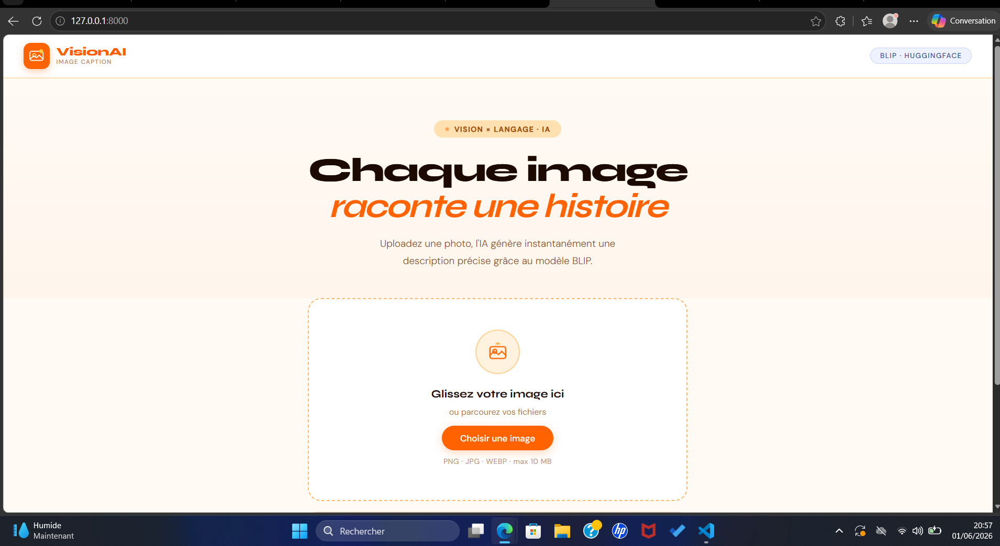

# ◈ ImageCaption AI

> **Génération automatique de légendes d'images par intelligence artificielle**



---

## 📌 Description

ImageCaption AI est une application web qui utilise le modèle **BLIP** (*Bootstrapping Language-Image Pre-training* de Salesforce) pour analyser une image et générer automatiquement une description textuelle précise en anglais. L'utilisateur uploade une photo, clique sur un bouton, et obtient en quelques secondes une légende produite par un modèle Transformer vision-langage.

---

## 🧠 Architecture du modèle

```
Image (PNG/JPG)
      │
      ▼
┌─────────────────────────────────────────┐
│         BLIP — Vision Encoder           │
│   (ViT-Base — Vision Transformer)       │
│  Découpe l'image en patches 16×16       │
│  → Embeddings visuels enrichis          │
└──────────────────┬──────────────────────┘
                   │
                   ▼
┌─────────────────────────────────────────┐
│      BLIP — Language Decoder            │
│  (Transformer auto-régressif)           │
│  Génère la légende token par token      │
│  via Beam Search (n_beams = 4)          │
└──────────────────┬──────────────────────┘
                   │
                   ▼
         "a dog running on the beach"
```

Le modèle est pré-entraîné sur **129 millions** de paires image-texte et affine avec un mécanisme de **bootstrapping** pour filtrer les données bruitées.

---

## 🖼️ Captures d'écran

| Zone d'upload | Résultat généré |
|---|---|
|  |  |

> **📸 Note :** Placer les captures dans le dossier `screenshots/` après le premier lancement.

---

## ⚙️ Technologies utilisées

| Couche | Technologie |
|---|---|
| Modèle IA | `Salesforce/blip-image-captioning-base` |
| Framework ML | PyTorch 2.3 + HuggingFace Transformers 4.41 |
| Backend | FastAPI 0.111 + Uvicorn |
| Frontend | HTML5 / CSS3 / Vanilla JS |
| Templates | Jinja2 |
| Déploiement | Hugging Face Spaces |

---

## 🚀 Installation & Exécution locale

### Prérequis
- Python 3.10 ou 3.11
- ~3 Go d'espace disque (pour le modèle)
- Connexion internet au premier démarrage (téléchargement du modèle)

### 1. Cloner le dépôt
```bash
git clone https://github.com/<votre-username>/image-captioning-ai.git
cd image-captioning-ai
```

### 2. Créer un environnement virtuel
```bash
python -m venv venv

# Windows
venv\Scripts\activate

# macOS / Linux
source venv/bin/activate
```

### 3. Installer les dépendances
```bash
pip install -r requirements.txt
```

### 4. Lancer l'application
```bash
uvicorn app:app --reload --host 0.0.0.0 --port 8000
```

### 5. Ouvrir dans le navigateur
```
http://localhost:8000
```

> **⏱️ Premier démarrage :** le modèle BLIP (~900 Mo) est téléchargé automatiquement depuis HuggingFace et mis en cache. Les démarrages suivants sont immédiats.

---

## ☁️ Déploiement sur Hugging Face Spaces

### 1. Créer un Space
1. Se connecter sur [huggingface.co](https://huggingface.co)
2. Cliquer **New Space** → SDK : **Docker** → Visibilité : Public

### 2. Créer le `Dockerfile`
```dockerfile
FROM python:3.11-slim

WORKDIR /app
COPY requirements.txt .
RUN pip install --no-cache-dir -r requirements.txt

COPY . .
EXPOSE 7860

CMD ["uvicorn", "app:app", "--host", "0.0.0.0", "--port", "7860"]
```

### 3. Pousser le code
```bash
git remote add space https://huggingface.co/spaces/<username>/<space-name>
git push space main
```

Le déploiement se fait automatiquement. L'URL sera :
`https://huggingface.co/spaces/<username>/<space-name>`

---

## 💡 Exemples de résultats

| Image | Légende générée |
|---|---|
| 🐕 Chien sur la plage | *"a brown dog running on the beach near the ocean"* |
| 🌆 Skyline de nuit | *"a city skyline at night with lights reflecting on the water"* |
| 🍕 Pizza | *"a pizza with tomato sauce cheese and vegetables on a wooden board"* |
| 🚴 Cycliste | *"a person riding a bicycle on a mountain trail"* |

---

## 🎬 Démonstration vidéo

▶️ **[Voir la démo sur YouTube](https://youtube.com/votre-lien)**

---

## ✅ Structure du projet

```
image-captioning-ai/
├── app.py                  # Backend FastAPI + inférence BLIP
├── requirements.txt        # Dépendances Python
├── Dockerfile              # Pour HuggingFace Spaces
├── ETUDIANTS.md            # Liste des étudiants
├── templates/
│   └── index.html          # Interface utilisateur
├── static/
│   ├── css/style.css       # Feuille de style
│   └── js/main.js          # Logique frontend
└── screenshots/            # Captures pour le README
    ├── interface.png
    ├── upload.png
    └── result.png
```

---

## 👤 Auteur

**[Votre Prénom Nom]**  
Étudiant en Génie Informatique  
🔗 [LinkedIn](https://linkedin.com/in/votre-profil) *(optionnel)*

---

## 📄 Licence

Ce projet est réalisé dans le cadre d'un cours d'Intelligence Artificielle.  
Modèle BLIP : licence Apache 2.0 — © Salesforce Research.
